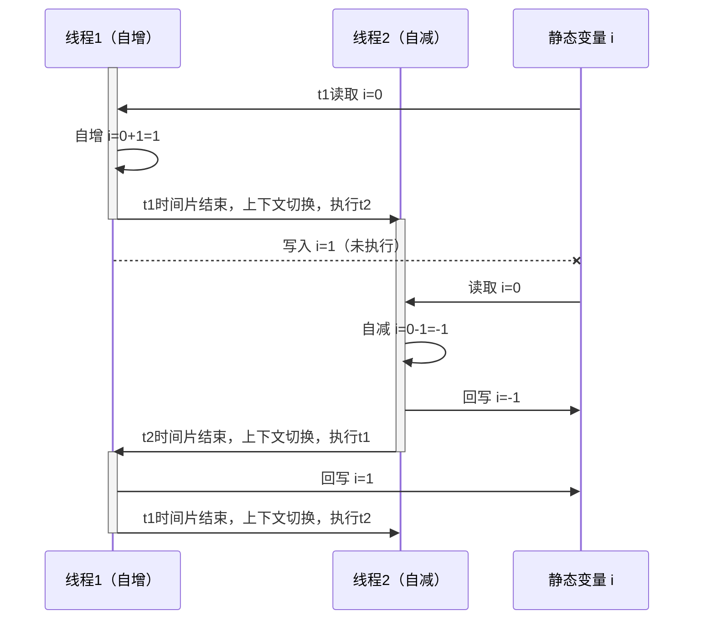
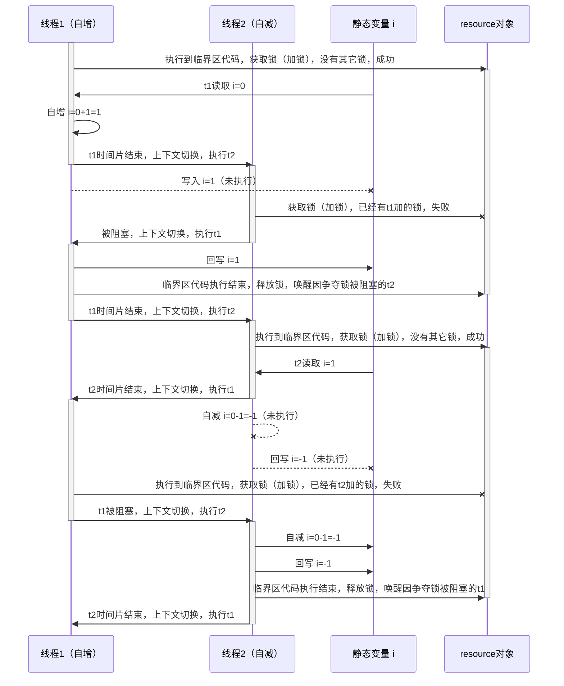
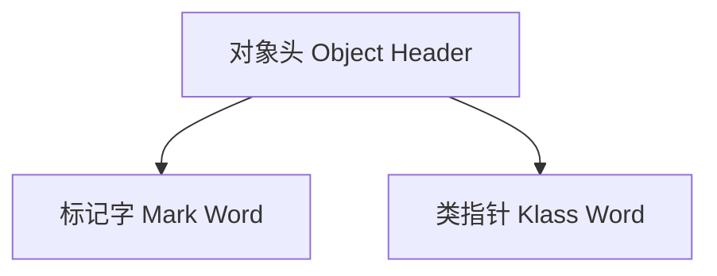
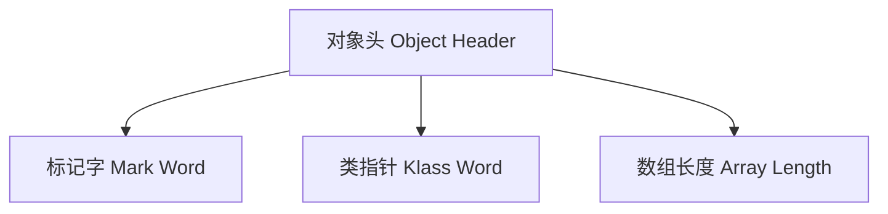

> 本文参考[黑马程序员全面深入学习Java并发编程，JUC并发编程全套教程](https://www.bilibili.com/video/BV16J411h7Rd?p=1)学习整理而成

# 共享模型之管程

共享模型 是传统的多线程模式下，线程之间的资源是共享的

## 共享模型的问题

在多个线程对共享资源进行操作的时候可能会出现一些问题，例如对让两个线程对初始值为 `0` 的静态变量分别做5000次自增和自减操作，结果是 `0` 吗？测试代码如下：

```java
/**
 * @description: 测试并发安全性问题
 * @author: lwh
 * @create: 2021/8/3 14:09
 * @version: v1.0
 **/
@Slf4j
public class TestConcurrency {
    static int i = 0;

    public static void main(String[] args) throws InterruptedException {
        Thread t1 = new Thread(() -> {
            for (int j = 0; j < 5000; j++) {
                i++;
            }
        }, "t1");
        Thread t2 = new Thread(() -> {
            for (int j = 0; j < 5000; j++) {
                i--;
            }
        }, "t2");

        t1.start();
        t2.start();

        t1.join();
        t2.join();

        log.debug("i：{}", i);
    }
}
```

上面的代码运行所得结果可能是 `0` ，也可能是正数或负数 ，为什么呢？

## 问题分析

因为我们在线程中对变量 `i` 的 **自增** 和 **自减** 操作并不是 **原子操作**

> 所谓原子操作就是一系列不能分割的操作，这些操作要么全部完成，要么都不执行

那么就会出现这种情况：线程 t1 正在让 i 从 0 自增到 1，恰好执行到往内存中回写自增结果 1 的操作的时候 CPU 时间片用完了，发生了上下文切换，此时线程 t2 读取到了 i 的值为 0 并进行了自减操作，i 变成了 -1 并且被成功回写到内存当中，而当 t1 再次获得 CPU 时间片执行回写操作时，又将结果 1 回写到了内存中，经过一次自增和自减操作，共享变量 i 从 0 变为了 1，这显然是不正确的



## 临界区 Critical Section

一个程序运行多个线程本身是没有问题的

问题出在多个线程访问**共享资源**：

* 多个线程**读共享资源**也没有问题
* 在多个线程中对**共享资源**的读写操作发生交错执行的情况时，就会出现问题

一段代码块内如果存在对**共享资源**的多线程读写操作，称这段代码块为**临界区**

## 竞态条件 Race Condition

多个线程在临界区内执行，由于代码的**执行顺序不同**而导致执行结果无法预测，称之为发生了**竞态条件**

## `synchronized` 解决方案

为了避免临界区的竞态条件的发生，有多种手段可以达到目的

* 阻塞式的解决方案：`synchronized`，`Lock`
* 非阻塞式的解决方案：原子变量

本节使用阻塞式的解决方案： `synchronized` ，即俗称的【对象锁】，它采用互斥的方式让同一时刻至多只有一个线程能持有【对象锁】，其它线程再想获取这个【对象锁】时就会阻塞住，这样就能保证拥有锁的线程可以安全的执行临界区内的代码，不用担心上下文切换导致共享资源被其它线程修改

虽然 Java 中互斥和同步都可以采用 `synchronized` 关键字来完成，但它们还是有区别的：

* 互斥是避免临界区竞态条件的发生，同一时刻只能有一个线程执行临界区代码
* 同步是由于线程执行的先后顺序不同，需要一个线程等待其它线程运行到某个点

下面是采用 `synchronized` 关键字时的解决方案代码：

```java
/**
 * @description: 测试并发安全性问题
 * @author: lwh
 * @create: 2021/8/3 14:09
 * @version: v1.0
 **/
@Slf4j
public class TestConcurrency {
    static int i = 0;
    // 模拟共享资源的对象，因为i为基本数据类型，并不是对象，所以不能作为synchronized的参数
    static final Object resource = new Object();

    public static void main(String[] args) throws InterruptedException {
        Thread t1 = new Thread(() -> {
            for (int j = 0; j < 5000; j++) {
                // 获取锁之后才能执行临界区代码
                synchronized (resource) {
                    i++;
                }
            }
        }, "t1");
        Thread t2 = new Thread(() -> {
            for (int j = 0; j < 5000; j++) {
                // 获取锁之后才能执行临界区代码
                synchronized (resource) {
                    i--;
                }
            }
        }, "t2");

        t1.start();
        t2.start();

        t1.join();
        t2.join();

        log.debug("i：{}", i);
    }
}
```

### 理解

下面是一个顺序图，在顺序图中解释了 `synchronized` 关键字的作用



> 上面顺序图中的时间片结束时间点只是模拟了会产生竞态条件的一种情况，**真正运行过程中是不确定的，并且线程数量也不止两个**，但是可以肯定的是，不管时间片在当前线程执行到临界区内哪行代码时结束， `synchronized` 关键字都可以保证竞态条件不会发生，因为当前线程持有对象锁时，其它所有线程即使都能获取时间片开始执行，但在没有获得共享资源对象锁的条件下，临界区代码是不能执行的，只能阻塞等待，待持有锁的线程执行完临界区代码释放锁之后，下一个获得锁的线程才能继续执行临界区代码，这样就**保证了临界区代码的执行是原子性的**

### 总结

上节中说过， `synchronized` 实际是使用**对象锁**保证了**临界区内代码执行的原子性**，临界区内的代码对外是不可分割的，不会被线程切换所打断

为了加深理解，请思考以下问题：

* 如果把 `synchronized(obj)`关键字放在 for 循环外面，执行情况是怎样的？
* 如果 `t1 synchronized(obj1)` 而 `t2 synchronized(obj2)`，有没有效果？
* 如果 `t1 synchronized(obj)` 而 t2 没有加会怎么样？

### 改进

在实际编程过程中，为了遵循 Java 面向对象的编程思想，上述例子中的共享资源 i 应该被封装到一个对象中，只向外提供必要的读取和修改 i 的方法，外部应该通过调用共享资源提供的一些列操作完成对共享资源的读取和修改，所以我们对上面的例子做出以下改进：

```java

/**
 * @description: 测试并发安全性问题
 * @author: lwh
 * @create: 2021/8/3 14:09
 * @version: v1.0
 **/
@Slf4j
public class TestConcurrency {
    static final Room room = new Room();

    public static void main(String[] args) throws InterruptedException {
        Thread t1 = new Thread(() -> {
            for (int j = 0; j < 5000; j++) {
                room.increment();
            }
        }, "t1");
        Thread t2 = new Thread(() -> {
            for (int j = 0; j < 5000; j++) {
                room.decrement();
            }
        }, "t2");

        t1.start();
        t2.start();

        t1.join();
        t2.join();

        log.debug("i：{}", room.getCount());
    }
}

class Room {
    private int count = 0;

    public void increment() {
        synchronized (this) {
            this.count++;
        }
    }

    public void decrement() {
        synchronized (this) {
            this.count--;
        }
    }

    public int getCount() {
        synchronized (this) {
            return this.count;
        }
    }
}
```

## 方法前的 `synchronized`

上小节中改进的代码中的 `Room` 对象的各个涉及临界区操作的方法都可以简化为下面这样：

```java
class Room {
    private int count = 0;

    public synchronized void increment() {
        this.count++;
    }

    public synchronized void decrement() {
        this.count--;
    }

    public synchronized int getCount() {
        return this.count;
    }
}
```

这样的写法与上一小节中的写法是等价的，也就是方法前的 `synchronized` 关键字的语义并不是给它所修饰的方法加锁，而是给 `this` 即当前对象加锁

另外，**静态方法** 前的 `synchronized` 关键字会给类对象加锁

> 特别的，处于同一个类中的被 `synchronized` 关键字修饰的静态方法和非静态方法之间是 **不互斥** 的，因为它们加锁的对象不是同一个对象，静态方法是给 **类对象** 加锁，而非静态方法是给 `this` 对象加锁

```java
class Test{

  public synchronized static void test() {

  }
  // 等价于
  public static void test() {
    synchronized (Test.class) {

    }
  }
}

```

## 变量的线程安全分析

### 成员变量和静态变量

如果它们没有共享，则线程安全

如果它们被共享了，根据它们的状态是否能够改变，分为以下两种情况：

* 如果所有线程对该变量只有读操作，则线程安全
* 如果既有读又有写，则需要考虑线程安全问题

### 局部变量

基本数据类型是线程安全的

引用数据类型根据其引用的作用范围分为以下两种情况：

* 如果该对象的引用未逃离临界区，则线程安全
* 如果该对象的引用逃离了临界区，则需要考虑线程安全问题
 
特别的，针对引用数据类型作用范围逃离临界区的这种情况，请看下面的例子：

```java
/**
 * @description: 看起来线程安全的操作
 * @author: lwh
 * @create: 2021/8/4 14:06
 * @version: v1.0
 **/
public class ThreadSeemSafe {
    public static void main(String[] args) {
        // ThreadSeemSafe t = new ThreadSeemSafe();
        ThreadSeemSafeSubClass t = new ThreadSeemSafeSubClass();
        Thread t1 = new Thread(t::run, "t1");
        Thread t2 = new Thread(t::run, "t2");

        t1.start();
        t2.start();
    }

    public void run() {
        ArrayList<String> list = new ArrayList<>();
        for (int i = 0; i < 2000; i++) {
            add(list);
            remove(list);
        }
    }

    public void add(List<String> list) {
        list.add("1");
    }

    public void remove(List<String> list) {
        list.remove(0);
    }
}

class ThreadSeemSafeSubClass extends ThreadSeemSafe {
    @Override
    public void remove(List<String> list) {
        new Thread(() -> list.remove(0)).start();
    }
}
```

上面代码中 t 的两种创建方式大家都分别多运行几遍，可以发现第一种方式不会出错，但是第二种方式偶尔会发生越界错误，问题在哪呢？

`run` 方法中的 `list` 变量在子类 `ThreadSeemSafeSubClass` 中发生了暴露，即该对象的引用逃离了临界区

`ThreadSeemSafe` 的子类 `ThreadSeemSafeSubClass` 重写了父类的 `remove` 方法，在自己的 `remove` 方法中创建了新的线程执行 `list` 的 `remove` 操作，就是这个时候，局部变量 `list` 被暴露给了一个新的线程，该线程操作的 `list` 对象和创建该线程的线程（t1 或 t2）中的 `list` 对象是同一个，这时就会产生竞态条件，例如还没有完成 `add` 操作时 remove 线程 进行了 `remove` 操作，这时 `list` 是空的，自然会报错

如何能够避免需要作为共享资源的局部变量暴露？

```java
/**
 * @description: 线程安全的操作
 * @author: lwh
 * @create: 2021/8/4 14:48
 * @version: v1.0
 **/
public class ThreadSeemSafe {
    public static void main(String[] args) {
        ThreadSeemSafeSubClass t = new ThreadSeemSafeSubClass();
        Thread t1 = new Thread(t::run, "t1");
        Thread t2 = new Thread(t::run, "t2");

        t1.start();
        t2.start();
    }
    public final void run() {
        ArrayList<String> list = new ArrayList<>();
        for (int i = 0; i < 2000; i++) {
            add(list);
            remove(list);
        }
    }
    // public final void add(List<String> list) {
    private void add(List<String> list) {
        list.add("1");
    }
    // public final void remove(List<String> list) {
    private void remove(List<String> list) {
        list.remove(0);
    }
}

class ThreadSeemSafeSubClass extends ThreadSeemSafe {
    // @Override
    public void remove(List<String> list) {
        new Thread(() -> list.remove(0)).start();
    }
}
```

通过限制访问权限为 `private` 或者增加 `final` 避免由于继承和重写而产生不可预知的自定义行为导致破坏程序的线程安全性

`run` 方法只建议添加 `final` 关键字而不建议将其访问权限修改为 `private` 的原因是它作为处理逻辑的入口方法，需要能够被外界调用，否则怎么让多个线程执行任务？但是，它不应该被重写，所以应该使用 `final` 而非 `private`

从这个例子中可以看出 `private` 和 `final` 提供 【安全】的意义所在，请体会 **开闭原则** 中的【闭】

### 常见线程安全类

String、Integer、StringBuilder、Random、Vector、Hashtable、java.util.concurrent包下的类

这里说他们是线程安全的是指多个线程调用它们同一个实例的某个方法时，是线程安全的，也可以理解为：

* 它们的每个方法都是原子的
* 但**注意**它们多个方法的组合不是原子的，见后面分析

> `String` 和 `Integer` 类是不同于其他类的线程安全类，其他类使用了 `synchronized` 关键字保证了线程安全，但 `String` 和 `Integer` 由于是 **不可变类** 保证了线程安全，之后会进行讲解

#### 不安全的方法组合

分析下面的代码是否线程安全？

```java
Hashtable table = new Hashtable();
// 有多个线程都会执行下面的代码
Object obj = table.get("key");
if(Objects.isNull(obj)){
  table.put("key", value);
}
```

虽然 `get` 和 `put` 方法都是原子性的，是线程安全的，但是假如某个线程执行到了 `get` 方法之后， `put` 方法之前的 `Objects.isNull(obj)` 语句时被打断了，由于已经执行完了 `get` 方法， `table` 对象的锁已经被释放，所以接下来获得时间片执行的线程可以对 `table` 加锁并对 `table` 进行读写，造成了线程安全问题

#### 不可变类

Sting、Integer 等都是不可变类，因为其内部的状态（属性）不可改变，因此它们的方法都是线程安全的，下面我们来看看 String 类中对字符串的 `substring` 修改操作是如何完成的：

```java
// 截自String类的源码
public String substring(int beginIndex) {
    if (beginIndex < 0) {
        throw new StringIndexOutOfBoundsException(beginIndex);
    }
    int subLen = value.length - beginIndex;
    if (subLen < 0) {
        throw new StringIndexOutOfBoundsException(subLen);
    }
    // 注意对于String的修改操作全是基于原字符串新创建了一个字符串实现修改效果的，原字符串对象并没有被修改，也就是内部状态不会被改变
    return (beginIndex == 0) ? this : new String(value, beginIndex, subLen);
}
```

所有的修改操作都是返回了一个新的结果对象而不对原本的对象做出修改的类，即内部状态不可改变的类，叫做不可变类，这种类是线程安全的

除此之外，无状态的类（没有成员变量的类）一般也都是线程安全的

### 实例分析

在 Web 项目中经常遇到的 `Servlet` 以及 Spring 框架中的 `Component` 组件等在程序运行期间往往都是单例模式存在的，而我们都知道在处理请求时，对于每个请求都会新建一个线程去处理，所以在多线程下对于这种单例存在的类需要考虑线程安全相关问题

例1：

```java
public class MyServlet extends HttpServlet {
    // 是否线程安全？否
    Map<String, Object> map = new HashMap<>();
    // 是否线程安全？是
    String s1 = "";
    // 是否线程安全？是
    final String s2 = "";
    // 是否线程安全？否
    Date d1 = new Date();
    // 是否线程安全？否
    final Date d2 = new Date();

    public void doGet(HttpServletRequest request, HttpServletResponse response) {
        // 使用上述变量
    }
}
```

例2：

```java
public class MyServlet extends HttpServlet {
    // 是否线程安全？否
    private UserService userService = new UserServiceImpl();

    public void doGet(HttpServletRequest request, HttpServletResponse response) {
        userService.update();
    }
}

public class UserServiceImpl implements UserService {
    // 是否安全？否

    // 记录调用次数
    private int count = 0;

    public void update() {
        count++;
    }
}
```

例3：

```java
@Aspect
@Component
public class MyAspect {
    // 是否线程安全？否
    private long start = 0L;

    @Before("exection(* *(...))")
    public void before() {
        start = System.nanoTime();
    }

    @After("exection(* *(...))")
    public void after() {
        long end = System.nanoTime();
        System.out.println("cost time: " + (end - start));
    }
}
// 可以使用 @Around 环绕通知结合局部变量实现耗时记录
```

例4：

```java
public class MyServlet extends HttpServlet {
    // 是否线程安全？是
    private UserService userService = new UserServiceImpl();

    public void doGet(HttpServletRequest request, HttpServletResponse response) {
        userService.update();
    }
}

public class UserServiceImpl implements UserService {
    // 是否安全？是
    private UserDao userDao = new UserDaoImpl();

    public void update() {
        userDao.update();
    }
}

public class UserDaoImpl implements UserDao {

    public void update() {
        String sql = "update table set what=0 where id = 0";
        // 是否安全？是
        // con对象是局部变量，是线程私有的
        try(Connection con = DriverManager.getConnection("","","")) {
            // ...
        } catch(...) {
          .// ...
        } finally {
          con.close();
        }
    }
}
```

例5：

```java
public class MyServlet extends HttpServlet {
    // 是否线程安全？否
    private UserService userService = new UserServiceImpl();

    public void doGet(HttpServletRequest request, HttpServletResponse response) {
        userService.update();
    }
}

public class UserServiceImpl implements UserService {
    // 是否安全？否
    private UserDao userDao = new UserDaoImpl();

    public void update() {
        userDao.update();
    }
}

public class UserDaoImpl implements UserDao {
    // 是否安全？否
    private Connection con = null;

    public void update() {
        String sql = "update table set what=0 where id = 0";
        // 是否安全？否
        // con对象是各个线程共享的资源，共享资源没有加锁
        con = DriverManager.getConnection("","","");
        // ...
        con.close();
    }
}
```

例6：

```java
public class MyServlet extends HttpServlet {
    // 是否线程安全？是
    private UserService userService = new UserServiceImpl();

    public void doGet(HttpServletRequest request, HttpServletResponse response) {
        userService.update();
    }
}

public class UserServiceImpl implements UserService {

    public void update() {
        // 是否安全？是
        // userDao 是局部变量，每个线程之间是独立的，所以 userDao 中的 con 对象也是独立的
        UserDao userDao = new UserDaoImpl();
        userDao.update();
    }
}

public class UserDaoImpl implements UserDao {
    // 是否安全？否
    private Connection con = null;

    public void update() {
        String sql = "update table set what=0 where id = 0";
        con = DriverManager.getConnection("","","");
        // ...
        con.close();
    }
}
```

例7：

```java
public abstract class Test {

  public void bar() {
    SimpleDateFormat sdf = new SimpleDateFormat("yyyy-MM-dd HH:mm:ss");
    foo(sdf);
  }

  public abstract void foo(SimpleDateFormat sdf);

  public static void main(String[] args) {
    new Test().bar();
  }
}
```

上面例7代码中的 `foo` 的行为是不确定的，可能导致线程安全问题，被称之为 **外星方法** ，属于局部引用变量泄露产生的线程安全问题

```java
// 有一个子类覆盖了 foo 方法
public void foo(SimpleDateFormat sdf) {
    String date = "1999-04-18 18:18:18";
    for (int i = 0; i < 100; i++) {
        // sdf 对象发生了泄露
        new Thread(() -> {
            try {
                sdf.parse(date);
            } catch (Exception e) {
                e.printStackTrace();
            }
        }).start();
    }
}
```

### 综合训练-卖票

测试下面的代码是否存在线程安全问题，并进行修改

```java
/**
 * @description: 卖票问题
 * @author: lwh
 * @create: 2021/8/5 9:56
 * @version: v1.0
 **/
public class SellTicketTest {
    static Random random = new Random();

    public static void main(String[] args) {
        // 售票窗口
        Window window = new Window(1000);
        // 售出的票数，线程共享资源，使用线程安全的 Vector
        List<Integer> sellCount = new Vector<>();
        // 所有的线程集合
        List<Thread> threadList = new ArrayList<>();

        // 先创建好所有线程
        for (int i = 0; i < 10000; i++) {
            Thread thread = new Thread(() -> {
                // 非原子操作
                int amount = window.sell(randomAmount());

                // 原子操作
                sellCount.add(amount);
            });
            threadList.add(thread);
        }

        // 让线程尽可能同时启动
        for (Thread thread : threadList) {
            thread.start();
        }

        // 等待运行结果
        for (Thread thread : threadList) {
            try {
                thread.join();
            } catch (InterruptedException e) {
                e.printStackTrace();
            }
        }

        System.out.println("售出的票数：" + sellCount.stream().mapToInt(i -> i).sum());
        System.out.println("剩余票数：" + window.getCount());
    }

    public static int randomAmount() {
        return random.nextInt(5) + 1;
    }
}

class Window {
    private int count;

    public Window(int count) {
        this.count = count;
    }

    public int getCount() {
        return this.count;
    }

    public int sell(int amount) {
        try {
            // 为了使 sell 操作在一个时间片内不能完成，减缓操作速度，因为如果处理速度足够块那么就不会发生线程安全问题
            Thread.sleep(1);
        } catch (InterruptedException e) {
            e.printStackTrace();
        }
        if (count >= amount) {
            count -= amount;
            return amount;
        }
        return 0;
    }
}
```

解决

```java
class Window {

    // ...

    public synchronized int sell(int amount) {
        try {
            Thread.sleep(1);
        } catch (InterruptedException e) {
            e.printStackTrace();
        }
        if (count >= amount) {
            count -= amount;
            return amount;
        }
        return 0;
    }
}
```

## Monitor 概念

顾名思义，Monitor 是 **监视器** 的意思，既然是监视器，那么就要有被监视的对象，这个对象就是共享资源对象。Monitor 是 `synchronized` 底层实现的一个工具对象，每个共享资源对象都各自拥有一个 Monitor 对象，Monitor 对象持有与之对应的共享资源对象的锁并且拥有这个锁的控制权，在搞清楚 Monitor 对象的工作原理之前我们先要了解一下Java 对象头的相关知识

### Java 对象头

对象头由一个**标记字**和一个**类指针**构成，其顶层结构根据对象类型分为两种情况

普通对象：



数组对象：



> 在32位系统中，普通对象头的大小是 `64 bits` ，其中标记字占用 `32 bits` ，类指针占用 `32 bits` ；而数组对象头的大小是 `96 bits` ，相比普通对象多了一个占用 `32 bits` 的数组长度字段

> 在64位系统中标记字、类指针、数组长度都占用 `64 bits`

标记字的数据结构如下：

32位虚拟机


64位虚拟机


关于标记字的数据结构我们可以在OpenJdk中的jvm源码文件中找到一些解释说明如下：

```java
//  32 bits:
//  --------
//             hash:25 ------------>| age:4    biased_lock:1 lock:2 (normal object)
//             JavaThread*:23 epoch:2 age:4    biased_lock:1 lock:2 (biased object)
//             size:32 ------------------------------------------>| (CMS free block)
//             PromotedObject*:29 ---------->| promo_bits:3 ----->| (CMS promoted object)
//
//  64 bits:
//  --------
//  unused:25 hash:31 -->| unused:1   age:4    biased_lock:1 lock:2 (normal object)
//  JavaThread*:54 epoch:2 unused:1   age:4    biased_lock:1 lock:2 (biased object)
//  PromotedObject*:61 --------------------->| promo_bits:3 ----->| (CMS promoted object)
//  size:64 ----------------------------------------------------->| (CMS free block)
//
//  unused:25 hash:31 -->| cms_free:1 age:4    biased_lock:1 lock:2 (COOPs && normal object)
//  JavaThread*:54 epoch:2 cms_free:1 age:4    biased_lock:1 lock:2 (COOPs && biased object)
//  narrowOop:32 unused:24 cms_free:1 unused:4 promo_bits:3 ----->| (COOPs && CMS promoted object)
//  unused:21 size:35 -->| cms_free:1 unused:7 ------------------>| (COOPs && CMS free block)
```

也可以通过访问下面的网址查看具体的源代码：

* [https://wiki.openjdk.java.net/display/HotSpot/CompressedOops](https://wiki.openjdk.java.net/display/HotSpot/CompressedOops)
* [https://wiki.openjdk.java.net/display/HotSpot/Synchronization](https://wiki.openjdk.java.net/display/HotSpot/Synchronization)
 

# 共享模型之内存

# 共享模型之无锁

# 共享模型之不可变
